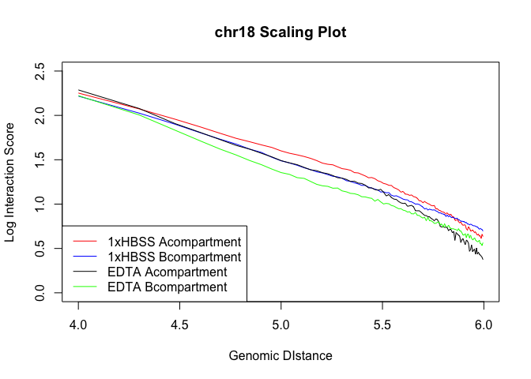

Introduction

In this project, I am studying the effects of different types of streses in the organization of the nucleus. The nucleus is three-dimensionally organized into chromosomal territories, Topological Associated Domains(TADs), active and inactive compartments and enhancer promoter loops. This organization is important for proper cellular functioning like DNA replication and repair. Cell nuclei have been treated with chelation buffers to see the changes that happen in organization of the genome inside of the nucleus. Nuclei expansion occurs upon treatment with EDTA compared to the control (HBSS). I am interested to observe the changes that happen upon expansion in single chromosomes.

``` r
## Create column names for the files to upload
log_names_test <- c("Genomic Distance", "Log Interaction Score")

## Input files in R and change their column name
HBSS_chr18_Acompartment <- read.table("RPMnuc-GM-1xHBSS-R2_chr18_Acompartment_1mb_log2.txt")
names(HBSS_chr18_Acompartment) <- log_names_test

HBSS_chr18_Bcompartment <- read.table("RPMnuc-GM-1xHBSS-R2_chr18_Bcompartment_1mb_log2.txt")
names(HBSS_chr18_Bcompartment) <- log_names_test

EDTA_chr18_Acompartment <- read.table("RPMnuc-GM-EDTA-R1_chr18_Acompartment_log2.txt")
names(EDTA_chr18_Acompartment) <- log_names_test

EDTA_chr18_Bcompartment <- read.table("RPMnuc-GM-EDTA-R1_chr18_Bcompartment_log2.txt")
names(EDTA_chr18_Bcompartment) <- log_names_test

## Make plots of chr18 A and B compartment for EDTA and HBSS conditions
plot(HBSS_chr18_Acompartment$`Genomic Distance`, HBSS_chr18_Acompartment$`Log Interaction Score`, col = "red", type = "l", xlab = "Genomic DIstance", ylab = "Log Interaction Score", main = "chr18 Scaling Plot", ylim = c(0, 2.5))
lines(HBSS_chr18_Bcompartment$`Genomic Distance`, HBSS_chr18_Bcompartment$`Log Interaction Score`, col = "blue", type = "l", xlab = "Genomic DIstance", ylab = "Log Interaction Score")
lines(EDTA_chr18_Acompartment$`Genomic Distance`, EDTA_chr18_Acompartment$`Log Interaction Score`, col = "black", type = "l", xlab = "Genomic DIstance", ylab = "Log Interaction Score")
lines(EDTA_chr18_Bcompartment$`Genomic Distance`, EDTA_chr18_Bcompartment$`Log Interaction Score`, col = "green", type = "l", xlab = "Genomic DIstance", ylab = "Log Interaction Score")
legend('bottomleft', c('1xHBSS Acompartment', '1xHBSS Bcompartment', 'EDTA Acompartment', 'EDTA Bcompartment'), lty=c(1,1,1,1), col = c('red', 'blue', 'black', 'green'))
```



Results/Discussion

EDTA is a chelation agent that will draw the salts out of the cell and therefore cause expansion of the cell and nuclei. As one can imagine, expansion of the nucleus can cause changes in the 3D organization of the genome. Little changes are observed in chr18 upon treatment with EDTA compared to the control (1xHBSS)
